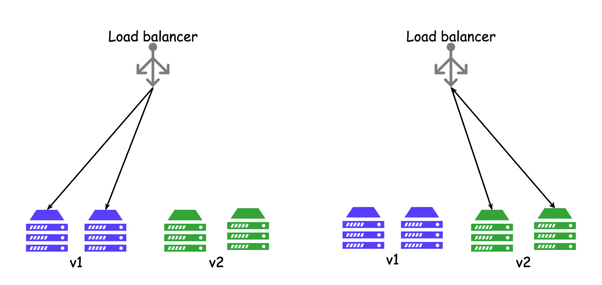
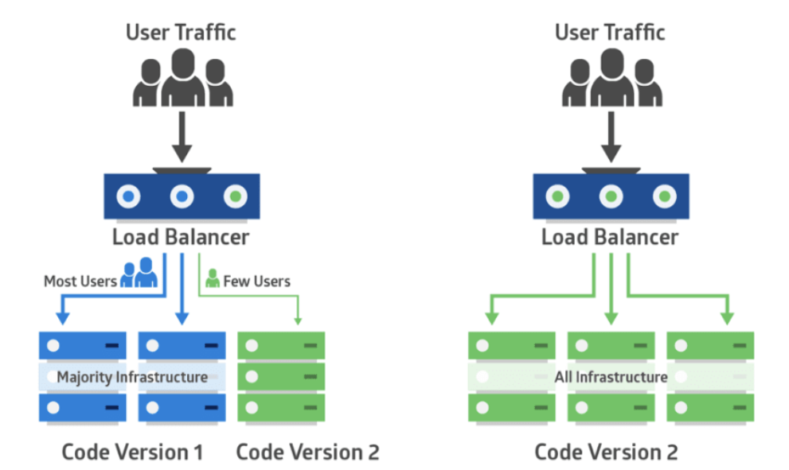

적절한 배포 패턴 구현
===================

## 롤링 배포

- 일반적인 배포 모델
> 기존 버전의 모델을 점진적으로 새 버전으로 업데이트 하는 모델

---

## 블루-그린 배포

- 기존 버전 : 블루
- 새 버전 : 그린
- 여러 개의 App Service 끼리 Swap
> 블루 환경의 서비스를 그린 환경에 복사 후 서비스 업데이트 및 테스트를 하고 나서 기존 사용자가 있는 블루 환경의 서비스를 그린 환경으로 옮기는 배포 패턴 

---

## 카나리 배포

&nbsp;
- 석탄을 캘 때 유독 가스 누출 위험을 알려주는 카나리아 새
> 이를 개발 프로세스에 적용하면...   
카나리아 배포는 새 버전을 릴리스하기 전에 미리 선제적으로 몇몇의 사용자들 혹은 서버에 새 버전을 배포하여 반응을 본 후 괜찮으면 전체에 배포하는 배포 패턴

